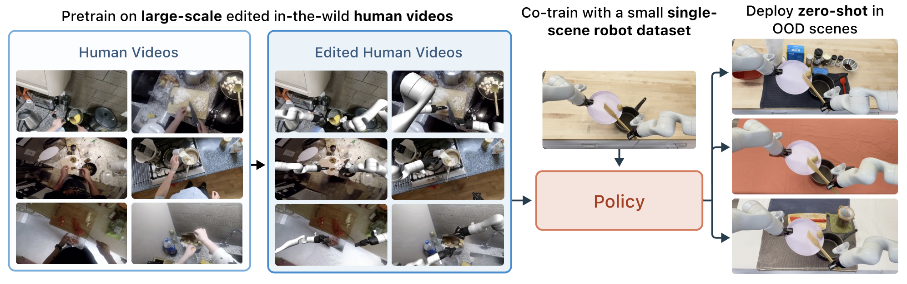

# Code for Phantom and Masquerade
[](https://www.python.org)
[](https://opensource.org/licenses/MIT)
<hr style="border: 2px solid gray;"></hr>

This repository contains the code used to process human videos in [Phantom: Training Robots Without Robots Using Only Human Videos](https://phantom-human-videos.github.io/) and [Masquerade: Learning from In-the-wild Human Videos using Data-Editing](https://masquerade-robot.github.io/). 

<table>
<tr>
  <td align="center" width="50%">
    <h3><a href="https://phantom-human-videos.github.io/">Phantom: Training Robots Without Robots Using Only Human Videos</a></h3>
    <p><em><a href=https://marionlepert.github.io/>Marion Lepert</a></em>, <em><a href=https://jiayingfang.github.io/>Jiaying Fang</a></em>, <em><a href=https://web.stanford.edu/~bohg/>Jeannette Bohg</a></em></p>
    <a href="https://phantom-human-videos.github.io/">
    
    </a>
  </td>
  <td align="center" width="50%">
    <h3><a href="https://masquerade-robot.github.io/">Masquerade: Learning from In-the-wild Human Videos using Data-Editing</a></h3>
    <p><em><a href=https://marionlepert.github.io/>Marion Lepert*</a></em>, <em><a href=https://jiayingfang.github.io/>Jiaying Fang*</a></em>, <em><a href=https://web.stanford.edu/~bohg/>Jeannette Bohg</a></em></p>
    
  </td>
</tr>
</table>

Both projects use data editing to convert human videos into “robotized” demonstrations. They share much of the same codebase, with some differences in the processing pipeline:

**Phantom**
* Input: RGBD videos with a single left hand visible in every frame.
* Data editing: inpaint the single human arm, overlay a rendered robot arm in the same pose.
* Action labels: extract full 3D end-effector pose (position, orientation, gripper)

**Masquerade**
* Input: RGB videos from [Epic Kitchens](https://epic-kitchens.github.io/2025); one or both hands may be visible, sometimes occluded.
* Data editing: segment and inpaint both arms, overlay a bimanual robot whose effectors follow the estimated poses (with a 3-4cm error along the depth direction due to lack of depth data)
* Action labels: use 2D projected waypoints as auxiliary supervision only (not full 3D actions)


## Installation
1. Clone this repo recursively 

```bash
git clone --recursive git@github.com:MarionLepert/phantom.git
```

2. Run the following script from the root directory to install the required conda environment.
```bash
./install.sh
```

3. Download the MANO hand models. To do so, go to the [MANO website](https://mano.is.tue.mpg.de/) and register to be able to download the models. Download the left and right hand models and move MANO_LEFT.pkl and MANO_RIGHT.pkl inside the `$ROOT_DIR/submodules/phantom-hamer/_DATA/data/mano/` folder.

## Getting Started
Process **Phantom** sample data (manually collected in-lab videos)
```bash
conda activate phantom

python process_data.py demo_name=pick_and_place data_root_dir=../data/raw processed_data_root_dir=../data/processed mode=all
```

Process **Masquerade** sample data ([Epic Kitchens](https://epic-kitchens.github.io/2025) video)
```bash
conda activate phantom

python process_data.py demo_name=epic data_root_dir=../data/raw processed_data_root_dir=../data/processed mode=all --config-name=epic
```


## Codebase Overview

### Process data
Each video is processed using the following steps:

1. **Extract human hand bounding boxes**: `bbox_processor.py` 
     * `mode=bbox`

2. **Extract 2d human hand poses**: `hand_processor.py` 
     * `mode=hand2d`: extract the 2d hand pose

3. **Extract human and arm segmentation masks**: `segmentation_processor.py`
     * `mode=hand_segmentation`: used for depth alignment in hand pose refinement (only works for hand3d)
     * `mode=arm_segmentation`: needed in all cases to inpaint the human 

2. **Extract 3d human hand poses**: `hand_processor.py` 
     * `mode=hand3d`: extract the 3d hand pose (note: requires depth, and was only tested on the left hand)

4. **Retarget human actions to robot actions**: `action_processor.py`
     * `mode=action` 

5. **Smooth human poses**: `smoothing_processor.py`
     * `mode=smoothing`

6. **Remove hand from videos using inpainting**: `handinpaint_processor.py`
     * `mode=hand_inpaint`
     * Inpainting method [E2FGVI](https://arxiv.org/pdf/2204.02663) is used.

7. **Overlay virtual robot on video**: `robotinpaint_processor.py`
     * `mode=robot_inpaint`: overlay a single robot (default) or bimanual (epic mode) robot on the image


### Config reference (see configuration files in `configs/`)

| Flag | Type | Required | Choices | Description |
|------|------|----------|---------|-------------|
| `--demo_name` | `str` | ✅ | - | Name of the demonstration/dataset to process |
| `--mode` | `str` (multiple) | ✅ | `bbox`, `hand2d`, `hand3d`, `hand_segmentation`, `arm_segmentation`, `action`, `smoothing`, `hand_inpaint`, `robot_inpaint`, `all` | Processing modes to run (can specify multiple with e.g. `'mode=[bbox,hand2d]'`) |
| `--robot_name` | `str` | ✅ | `Panda`, `Kinova3`, `UR5e`, `IIWA`, `Jaco` | Type of robot to use for overlays |
| `--gripper_name` | `str` | ❌ | `Robotiq85` | Type of gripper to use |
| `--data_root_dir` | `str` | ❌ | - | Root directory containing raw video data |
| `--processed_data_root_dir` | `str` | ❌ | - | Root directory to save processed data |
| `--epic` | `bool` | ❌ | - | Use Epic-Kitchens dataset processing mode |
| `--bimanual_setup` | `str` | ❌ | `single_arm`, `shoulders` | Bimanual setup configuration to use (shoulders corresponds to the bimanual hardware configuration used in Masquerade) |
| `--target_hand` | `str` | ❌ | `left`, `right`, `both` | Which hand(s) to target for processing |
| `--camera_intrinsics` | `str` | ❌ | - | Path to camera intrinsics file |
| `--camera_extrinsics` | `str` | ❌ | - | Path to camera extrinsics file |
| `--input_resolution` | `int` | ❌ | - | Resolution of input videos |
| `--output_resolution` | `int` | ❌ | - | Resolution of output videos |
| `--depth_for_overlay` | `bool` | ❌ | - | Use depth information for overlays |
| `--demo_num` | `str` | ❌ | - | Process a single demo number instead of all demos |
| `--debug_cameras` | `str` (multiple) | ❌ | - | Additional camera names to include for debugging |
| `--constrained_hand` | `bool` | ❌ | - | Use constrained hand processing |
| `--render` | `bool` | ❌ | - | Render the robot overlay on the video |

**Note** Please specify `--bimanual_setup single_arm` along with `--target_hand left` or `--target_hand right` if you are using single arm. For bimanual setups, use `--bimanual_setup shoulders`.

### Camera details
* **Phantom**: a Zed2 camera was used to capture the sample data at HD1080 resolution. 
* **Masquerade**: We used Epic-Kitchens videos and used the camera intrinsics provided in the dataset. To use videos captured with a different camera resolution, update the camera intrinsics and extrinsics files in `$ROOT_DIR/phantom/camera/`.

### Train policy
After processing the video data, the edited data can be used to train a policy. The following files should be used:

* Observations
  * Phantom Samples: extract RGB images from `data/processed/pick_and_place/*/video_overlay_Panda_single_arm.mkv`
  * Epic (In-the-wild Data) Samples: extract RGB images from `data/processed/epic/*/video_overlay_Kinova3_shoulders.mkv`

* Actions
  * Phantom Samples: All data stored in `data/processed/pick_and_place/*/inpaint_processor/training_data_single_arm.npz`
  * Epic (In-the-wild Data) Samples: All data stored in `data/processed/epic/*/inpaint_processor/training_data_shoulders.npz`


In Phantom, [Diffusion Policy](https://github.com/real-stanford/diffusion_policy) was used for policy training.


## Citation
```bibtex
@article{lepert2025phantomtrainingrobotsrobots,
        title={Phantom: Training Robots Without Robots Using Only Human Videos}, 
        author={Marion Lepert and Jiaying Fang and Jeannette Bohg},
        year={2025},
        eprint={2503.00779},
        archivePrefix={arXiv},
        primaryClass={cs.RO},
        url={https://arxiv.org/abs/2503.00779}, 
  }
```

```bibtex
@misc{lepert2025masqueradelearninginthewildhuman,
      title={Masquerade: Learning from In-the-wild Human Videos using Data-Editing}, 
      author={Marion Lepert and Jiaying Fang and Jeannette Bohg},
      year={2025},
      eprint={2508.09976},
      archivePrefix={arXiv},
      primaryClass={cs.RO},
      url={https://arxiv.org/abs/2508.09976}, 
}
```
